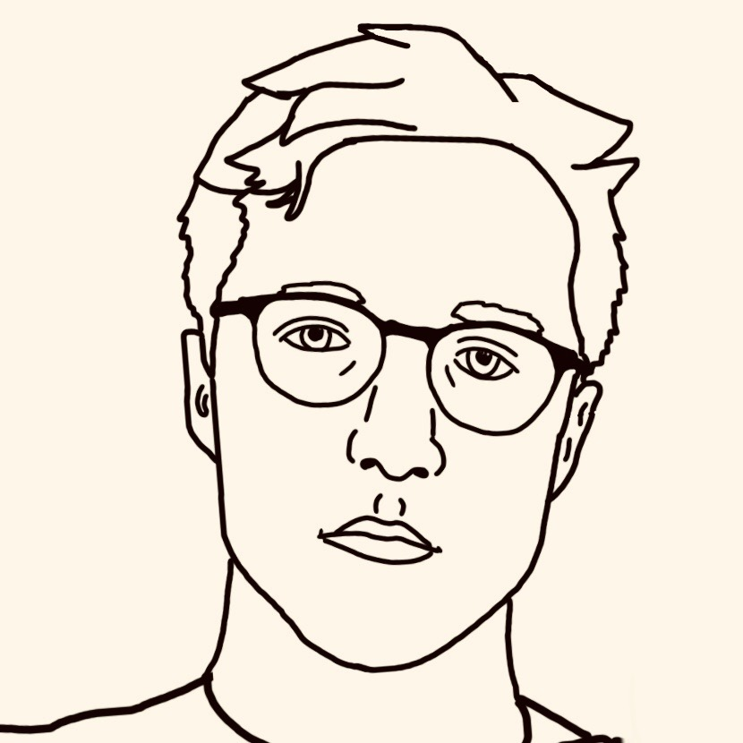

# Career Opportunities

I'm not actively looking for a new job right now but I'm always
interested in hearing about what's out there. If you'd like to tell
me a bit about the position you're looking to fill please
[fill out this form to tell me about the opportunity](https://goo.gl/forms/t9YXBy5Wr6KtNoWq2).

<a href="https://goo.gl/forms/t9YXBy5Wr6KtNoWq2" class="pca">
    Tell me about a job opportunity
</a>

Please be respectful and do not send unsolicited email, texts or
voice messages. I will not share your submissions on the open
internet, but I may discuss opportunities with close friends.

## About me

[I](https://collapse.io) live in Brooklyn, New York and am married to [Hannah](https://www.linkedin.com/in/hannah-morrison/).
I'm employed by [Slack](https://slack.com) as a Senior Staff Software Engineer with the
[Search, Learning and Intelligence](https://slackhq.com/inside-slacks-search-learning-and-intelligence-team-c77398b6c571) group.
Previous to that I had been a Principal Software Engineer at [Etsy](https://etsy.com).

You can find me at

* [https://keybase.io/asmorrison](https://keybase.io/asmorrison)
* [github.com/morria](https://github.com/morria/)
* [twitter.com/asmorrison](https://twitter.com/asmorrison)
* [linkedin.com/in/andrewsmorrison](http://www.linkedin.com/in/andrewsmorrison)

<style>
body {
    color: #444;
    margin: 20px auto;
    padding: 20px;
    max-width: 500px;
    font-family: "Helvetica Neue", Helvetica, Arial, sans-serif;
    font-size: 14px;
    line-height: 20px;
    text-rendering: optimizelegibility;
}

body > div.container-lg > h1:first-child {
    display: none;
}

h1, h2 {
    font-weight: 100 !important;
    letter-spacing: 0.1em;
    margin-bottom: 1em !important;
    border-bottom: none !important;
}

ul li {
    margin-bottom: 8px;
}

img {
    width: 100%;
    border-radius: 2px;
}

a {
    color: #ff7700;
    text-decoration: none;
}

a.pca {
    background-color: #fc6921;
    border-radius: 3px;
    margin: 24px auto;
    text-align: center;
    color: #fff;
    font-weight: bold;
    width: 300px;
    padding: 12px 18px;
    display: block;
}
